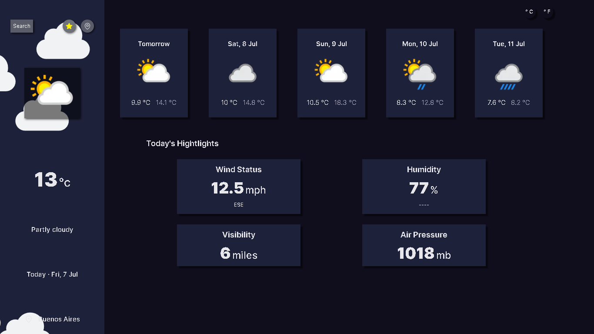

# Weather App



## Installation

Install Weather App with npm

- Clone of the repo in your local
- Run `npm run i` or `yarn run install`
- The project runs on port `3000`


```bash
  cd weather-app
  npm install / yarn run install
```
    
## Try Weather App

- Get API KEY of Weather in [here](https://www.weatherapi.com)
- After getting api key, add it in your .env file `APIKEY`

```bash
    APIKEY = XXXXXX
```

Now, you can play with the chat

## Structure

### Stack 
    Next.js for framework
    Zustand for state management
    Axios for request to API 